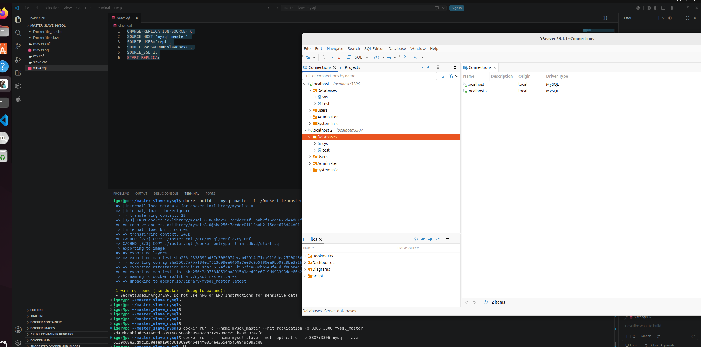

# Практическое задание с самопроверкой «Репликация и масштабирование. Часть 1 Дедяхин Игорь

### Задание 1

На лекции рассматривались режимы репликации master-slave, master-master, опишите их различия.
Ответить в свободной форме.


### Решение
В master-slaveодин сервер обрабатывае все операции и передает изменения slave-серверам. В режиме master-master оба сервера могут принимать запросы на запись и обмениваться изменениями друг с другом.


### Задание 2

Выполните конфигурацию master-slave репликации, примером можно пользоваться из лекции.
Приложите скриншоты конфигурации, выполнения работы: состояния и режимы работы серверов.

### Решение

Dockerfile-master:
```
FROM mysql:8.0
COPY ./master.cnf /etc/mysql/conf.d/my.cnf
COPY ./master.sql /docker-entrypoint-initdb.d/start.sql
ENV MYSQL_ROOT_PASSWORD=12345
CMD ["mysqld"]
```
master.conf
```
[mysqld]
server-id=1
log-bin = mysql-bin
binlog_format=ROW
```
master.sql
```
CREATE USER 'repl'@'%' IDENTIFIED BY 'slavepass';
GRANT REPLICATION SLAVE ON *.* TO 'repl'@'%';
FLUSH PRIVILEGES;
```


Dockerfile-slave:
```
FROM mysql:8.0
COPY ./slave.cnf /etc/mysql/conf.d/my.cnf
COPY ./slave.sql /docker-entrypoint-initdb.d/start.sql
ENV MYSQL_ROOT_PASSWORD=12345
CMD ["mysqld"]
```
slave.conf
```
[mysqld]
server-id = 2
read-only = 1
```
slave.sql
```
CHANGE REPLICATION SOURCE TO
SOURCE_HOST='mysql_master',
SOURCE_USER='repl',
SOURCE_PASSWORD='slavepass',
SOURCE_SSL=1;
START REPLICA;
```




### Задание 3*
Выполните конфигурацию master-master репликации. Произведите проверку.
Приложите скриншоты конфигурации, выполнения работы: состояния и режимы работы серверов.

### Решение
